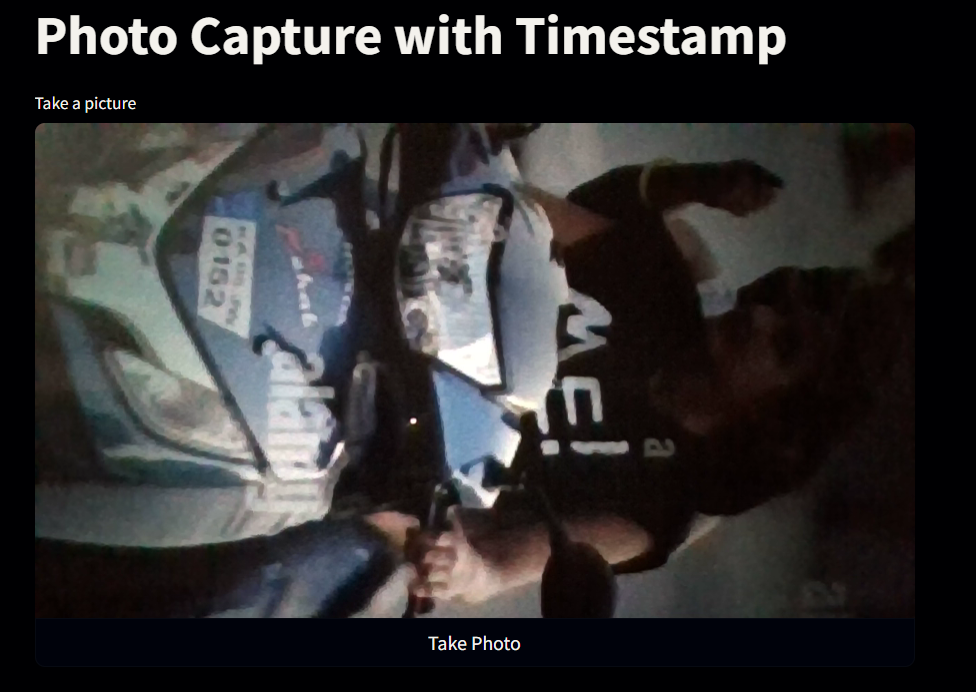
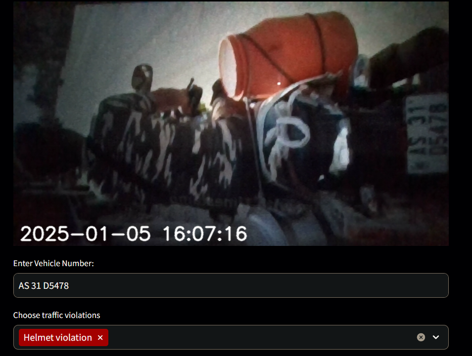
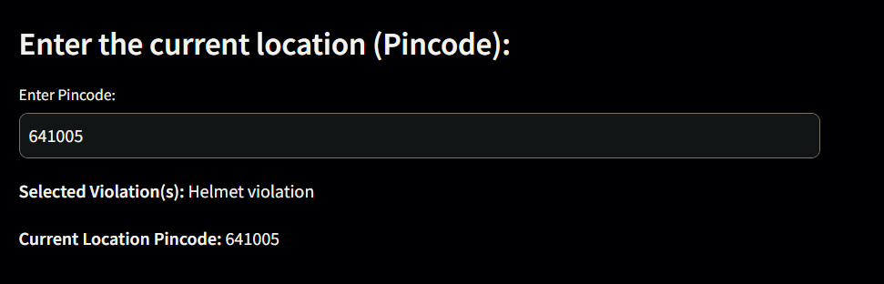
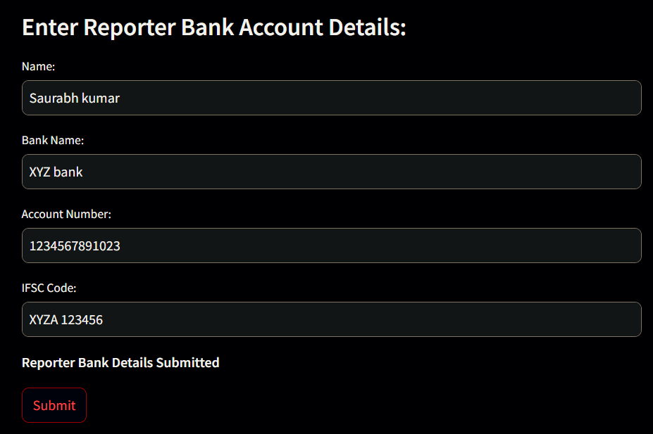
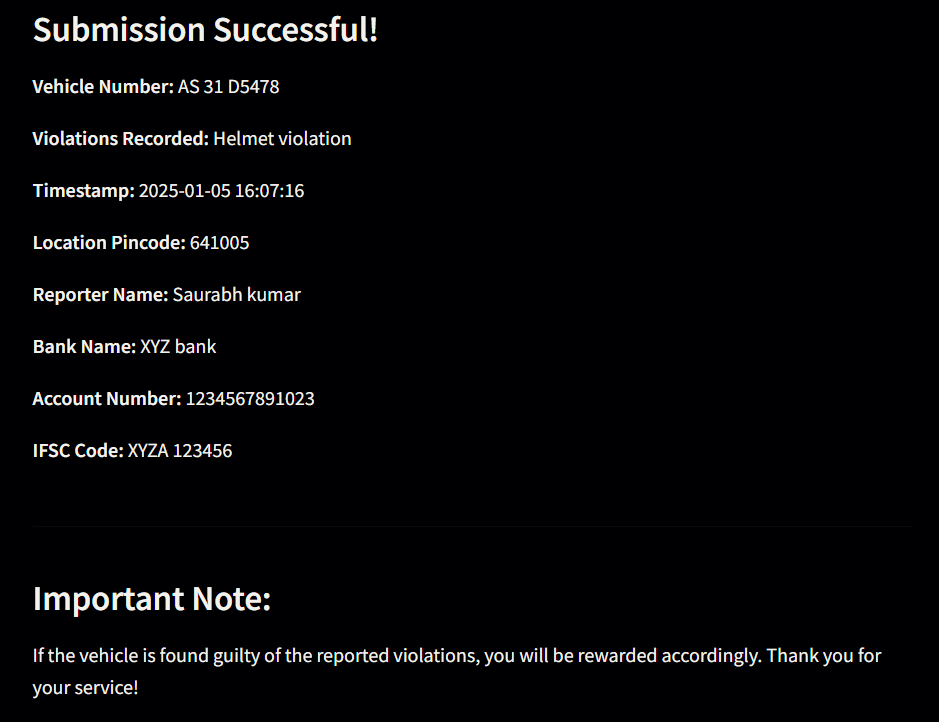

# RoadHero

**RoadHero** is a web-based application that allows users to capture images of traffic violations, report them, and provide relevant details such as vehicle number, violations, location, and bank account details for a reward. This project leverages Streamlit for the frontend, OpenCV for image processing, and allows real-time timestamp application on images.

## Features

- Capture images with timestamp using your device’s camera.
- Input vehicle number and select traffic violations.
- Enter location via pincode.
- Submit bank account details for reward purposes.
- Provide an option for submitting the report with complete details.
- Reward for valid reports of violations based on the submission.

## How to Use

1. **Capture Image**: Click on the "Take a picture" button to capture a photo of the traffic violation.

    

2. **Enter Vehicle Number & Select Violations**: Provide the vehicle number associated with the violation.

    

3. **Enter Location**: Input the pincode of the location where the violation occurred.

    

4. **Reporter Bank Details**: Enter your bank details (name, bank name, account number, IFSC code) to receive a reward if the violation is validated.

    

5. **Submit**: Press the "Submit" button to send the report.

    


## Tech Stack

- **Frontend**: Streamlit
- **Image Processing**: OpenCV
- **Backend**: Python
- **Libraries**:
  - `streamlit` for web app interface.
  - `opencv-python` for image manipulation and timestamping.
  - `numpy` for array manipulation.
  - `datetime` for timestamp.
  
## Requirements

Install the necessary dependencies by running:

```bash
pip install -r requirements.txt
